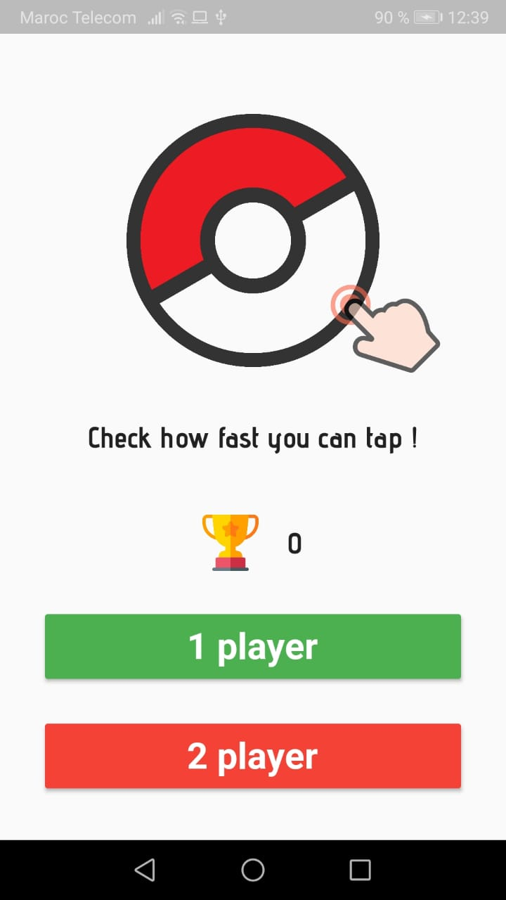
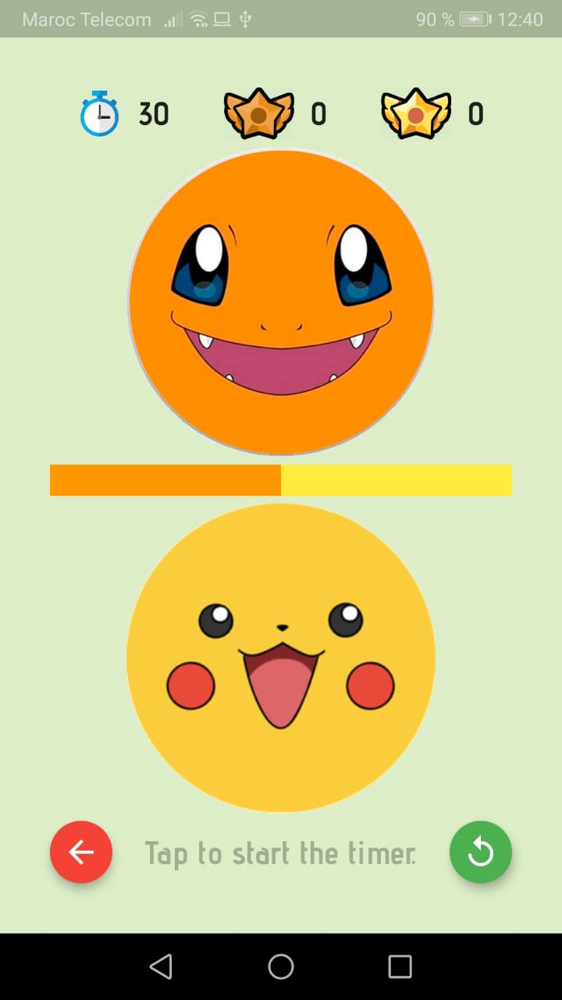
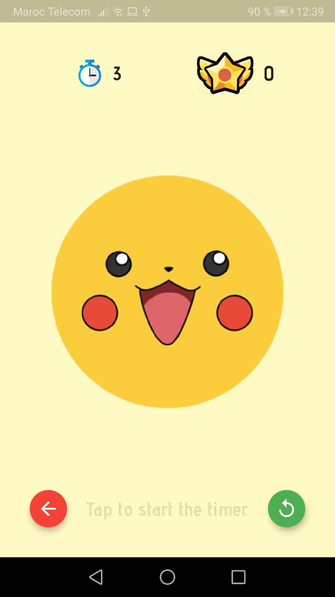

# tap_it

This is a simple tap game where you can play by your self or with another player. The goal is to tap as fast as you can before
the time out ! Enjoy.

# My experience
This project took me a whole week with 10 hours of work.
First of all I created the squeleton of the app then I tried to add the design
(Pokemon Theme )
Always striving to be better !

# Functionnalities
- A local highscore system.
- Two modes : Solo player and Two player mode.
- Smooth Animations.
- Cute design. hihihi

# Screenshots

  
  &nbsp
  
  &nbsp
  

## Getting Started

This project is a starting point for a Flutter application.

A few resources to get you started if this is your first Flutter project:

- [Lab: Write your first Flutter app](https://flutter.dev/docs/get-started/codelab)
- [Cookbook: Useful Flutter samples](https://flutter.dev/docs/cookbook)

For help getting started with Flutter, view our
[online documentation](https://flutter.dev/docs), which offers tutorials,
samples, guidance on mobile development, and a full API reference.
